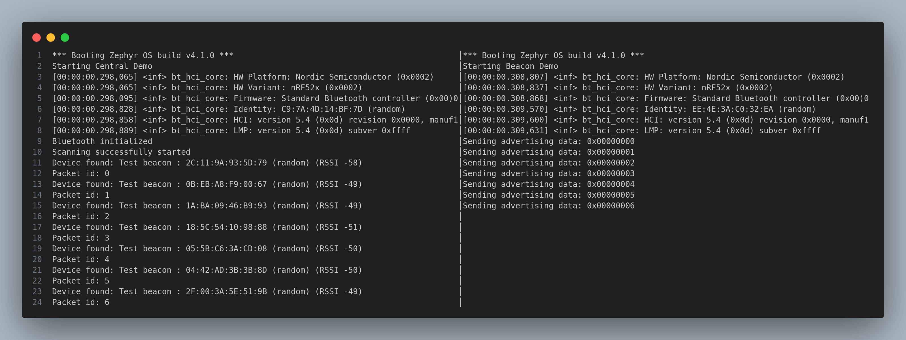

# AirPulse

AirPulse is a Zephyr-based application that provides a simple way to measure the quality of a wireless link between two devices. It uses BLE to transmit data and can be used to test the performance of a wireless link in various environments.
# Getting Started

## Prerequisites
- Zephyr SDK
- CMake
- A compatible board (e.g., nRF52840)
- Python 3.x
- `west` tool for managing Zephyr projects
- `pip` for installing Python dependencies

## Installation
1. Clone the AirPulse repository:
2. ```bash
    git clone git@github.com:LostFuse/AirPulse.git
    cd AirPulse
    ```
3. Initialize the Zephyr project:
   ```bash
   west init -l .
   west update
   ```

## Building the Application
1. Build the application for your target board:
   ```bash
   west build -b nrf52840dk_nrf52840


## Flashing for various boards

### NRF52840 Dongle
1. Connect the dongle to your computer.
2. Enter bootloader mode by pressing the reset button.
3. Flash the application:
   ```bash
   nrfutil nrf5sdk-tools pkg generate --hw-version 52 --sd-req=0x00 --application build/zephyr/zephyr.hex --application-version 1 dfu.zip && nrfutil nrf5sdk-tools dfu usb-serial -pkg dfu.zip -p <serial_port>
   ```

### XIAO NRF52840
1. Connect the XIAO NRF52840 to your computer.
2. Enter UF2 mode by pressing the reset button twice.
3. Copy the `build/zephyr/zephyr.uf2` file to the device.


# Example Usage


